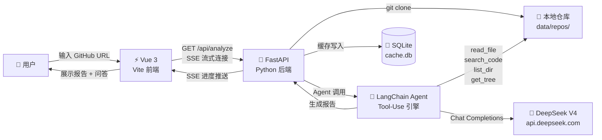

<p align="center">
  
  
  
  
  
</p>

<h1 align="center">🔍 Project Helper</h1>
<h3 align="center">项目学习助手 — 秒懂任何开源项目</h3>

---

## 产品定位

**读开源项目源码太痛苦了。** 目录结构陌生、模块调用链复杂、设计意图隐藏在代码深处——新人往往花几天甚至几周才能理清一个中型项目。

Project Helper 用 AI Agent 帮你解决这个问题：**输入一个 GitHub 仓库地址，自动克隆、深度分析源码，生成一份人人都能读懂的完整报告。** 还可以像聊天一样对项目源码随时提问。

> *"Don't read the code. Understand it."*

---

## 核心功能

| 功能 | 说明 |
|------|------|
| 🔄 **全自动克隆分析** | 输入 GitHub URL，系统自动 `git clone`、扫描目录、读取关键文件 |
| 🧠 **Agentic 源码解析** | 基于 LangChain Agent 架构，AI 自主决策要读哪些文件、搜索哪些模式 |
| 📡 **SSE 实时进度** | 分析过程通过 Server-Sent Events 流式推送，不做"黑盒等待" |
| 💬 **交互式问答** | 分析完成后，可以对源码任意提问——Agent 会实时搜索代码来回答 |
| 💾 **智能缓存** | 同一版本只分析一次，按 `(repo_url, commit_hash)` 建立缓存索引 |
| 🎨 **极简暗色 UI** | 深色科技风主题，Markdown 渲染 + 代码语法高亮，阅读体验舒适 |

### 分析报告涵盖

```
项目概述  →  技术栈  →  目录结构  →  核心模块  →  数据流  →  设计模式  →  阅读建议
```

---

## 系统架构



### 技术选型理由

| 决策 | 选择 | 理由 |
|------|------|------|
| 大模型 | DeepSeek V4 Pro | 性价比最高，支持 Tool Use，中文理解优秀 |
| Agent 框架 | LangChain | 生态成熟，`create_agent` API 简洁，流式输出原生支持 |
| 进度推送 | SSE（非 WebSocket） | 单向推送场景，SSE 更轻量，浏览器原生 `EventSource` 支持 |
| 前端 | Vue 3 + Vite | 响应式数据绑定天然适合实时进度更新 |
| 缓存 | SQLite | 零配置嵌入式数据库，完美契合单机工具场景 |

---

## 快速开始

### 前置要求

- **Python** ≥ 3.11
- **Node.js** ≥ 18
- **Git**（用于克隆目标仓库）
- **DeepSeek API Key**（[免费注册获取](https://platform.deepseek.com/)，新用户送额度）

### 1. 克隆本项目

```bash
git clone https://github.com/YOUR_USERNAME/project-helper.git
cd project-helper
```

### 2. 配置 API Key

```bash
# 复制配置模板
cp .env.example .env

# 编辑 .env，填入你的 DeepSeek API Key
# DEEPSEEK_API_KEY=sk-your-api-key-here
```

### 3. 启动后端（Python）

```bash
cd backend
pip install -r requirements.txt
python main.py
# → 服务运行在 http://localhost:8000
```

### 4. 启动前端（Vue）

```bash
cd frontend
npm install
npm run dev
# → 服务运行在 http://localhost:3000
```

### 5. 开始使用

浏览器打开 `http://localhost:3000`，输入任意 GitHub 仓库地址即可。

> 试试：`facebook/react` · `fastapi/fastapi` · `vuejs/core`

---

## 项目结构

```
project-helper/
├── backend/                # Python FastAPI 后端
│   ├── main.py             # API 路由 + SSE 服务
│   ├── agent.py            # LangChain Agent（分析 + 问答）
│   ├── git_utils.py        # Git 克隆 / 文件搜索 / 目录树
│   ├── database.py         # SQLite 缓存层
│   ├── config.py           # 配置（自动加载 .env）
│   └── requirements.txt
├── frontend/               # Vue 3 前端
│   └── src/
│       ├── views/
│       │   ├── Home.vue    # 首页：输入框 + 项目列表
│       │   ├── Analysis.vue # 分析页：实时进度 + 报告渲染
│       │   └── QAPage.vue  # 问答页：聊天式交互
│       └── components/     # UI 组件
├── .env.example            # 环境变量模板
└── README.md
```

---

## 产品规划（Roadmap）

- [ ] **批量分析**：支持一次性输入多个仓库地址
- [ ] **报告导出**：支持导出 Markdown / PDF
- [ ] **差异对比**：同一项目不同版本的代码变更分析
- [ ] **多模型支持**：兼容 OpenAI / Claude / 本地模型
- [ ] **Docker 部署**：一键启动前后端

---

## License

MIT © 2025
